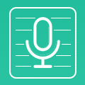

# note-buddy

<span>&nbsp; &nbsp; &nbsp;</span>

<h2> Installation</h2>
<p> first u gotta clone this thing </p>

```
git clone https://github.com/franklinqye/note-buddy.git
```

<p>oh yeah don't forget the pods too, run this command in the root directory of the project folder you just cloned</p>

```
pod install
```

<p>if you don't have cocopods installed (big oof) you can install 
it <a href="https://guides.cocoapods.org/using/getting-started.html">here</a>
and then install the pods necessary above</p>

<p>then you have to make sure you open the note-buddy.xcworkspace file <b>NOT</b> the 
note-buddy.xcodeproj or else the pod dependencies may or may not get imported properly 
<a href="https://guides.cocoapods.org/using/troubleshooting.html#using-the-cocoapods-project">(sauce)</a>.</p>

<h2>The App</h2>
<p>Note-buddy is the new and cool way to record lectures and take notes- all without writing a single thing down! Here's how it works:</p>

<ol>
  <li>Install and open up Note-buddy</li>
  <li>Start recording lecture</li>
  <li>End recording and save!</li>
</ol>

<p> that's it! your done! now prof's notes are safely saved using advanced algorithms to find the meat of the lecture, 
and discard the rest of the junk. Not only does this save time and effort, but actually lets you doze off in class as you know
note-buddy will do the job for you</p>

<h2>Credits and Recognition</h2>

<p>credits go to dan "pandan" lin for totally having knowlage about swift & xcode and not learning it all on the spot</p>
